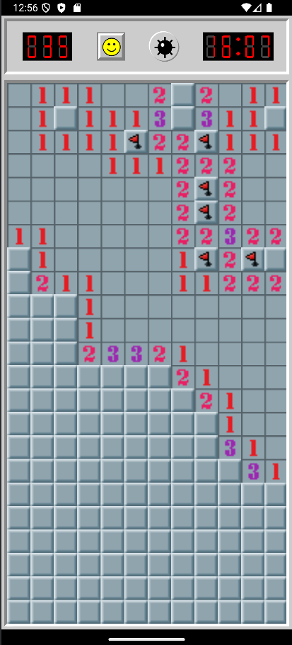

# BattleSweeper

BattleSweeper is a Minesweeper-inspired Android game built with Kotlin and Jetpack Compose.

The project was created as a personal software development project to strengthen my experience with modern Android development, application architecture, and UI design. It is being developed incrementally, with an emphasis on maintaining a clean separation between game logic, application state, and the UI.



## Features

* Minesweeper-style tile-based gameplay
* Mine counter
* Game timer
* Flag mode for marking suspected mines
* Seven-segment-style game displays
* Navigation between application screens
* Reactive UI state using `StateFlow`

## Technology

* **Kotlin**
* **Jetpack Compose**
* **Android SDK**
* **Android Jetpack Navigation**
* **MVVM architecture**
* **StateFlow / Kotlin Coroutines**

## Architecture

The project follows an MVVM-based structure designed to keep the UI separate from the underlying game logic.

At a high level:

```text
UI (Jetpack Compose)
        │
        ▼
ViewModel
        │
        ▼
Game State / Game Logic
```

The `ViewModel` exposes the current game state to the UI through a `StateFlow`. User interactions are passed back to the `ViewModel`, which updates the game state and allows Compose to reactively update the interface.

## Current Status

BattleSweeper is an active work-in-progress project.

The core game functionality and initial application navigation are implemented, while additional features and refinements are being developed.

Planned work includes:

* End-of-game and results screens
* Persistent game state
* Statistics and lifetime records
* Additional settings
* More polished application UI
* Continued refinement of the game architecture
* Possibly future multiplayer functionality

## Development Goals

The main goals of the project are to:

1. Build a complete Android application using Kotlin and Jetpack Compose.
2. Apply clean separation between UI, state management, and game logic.
3. Gain practical experience with modern Android architecture.
4. Create a substantial personal project that demonstrates software development skills outside of my professional experience.
